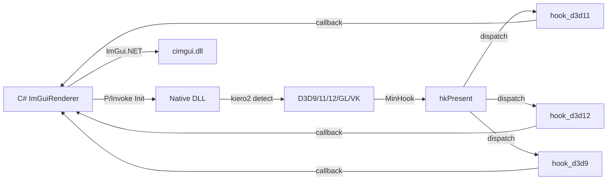

# StArray.ModManager

Android IL2CPP Unity mod manager with CoreCLR runtime embedding and ImGui overlay UI.

## How It Works

1. **Native injection** via `libmodmanager.so` loaded into Unity process
2. **Dobby hook** on `eglSwapBuffers` and Android input events
3. **CoreCLR embedded** at runtime, launching .NET managed code from JNI
4. **UnityResolve** reflection engine traverses IL2CPP/Mono managed types
5. **ImGui overlay** rendered via EGL + OpenGL ES with touch and keyboard IME

## Features

- **EGL SwapBuffers hook** with Dobby — renders ImGui overlay every frame
- **Touch & key input** via InputConsumer hooks + cimgui Android backend
- **IME support** (Chinese/Japanese) via custom KeyboardView + InputConnection bridge
- **Mod system** — scan/load/unload with dependency resolution + auto-enable on restart
- **Mod overlay API** — `OnBackgroundGUI` / `OnForegroundGUI` for direct game-screen drawing
- **Auto-update** — OTA version check + download + SHA-256 verification + restart
- **Config persistence** — STJ source-gen JSON, AOT-compatible
- **File logging** — dual-write to logcat + `manager.log`
- **GL debug panel** — caps toggles, blend/depth func selectors, GL state queries
- **FontAwesome 7** icon support via embedded resource
- **IImGuiRenderer** interface — swap between EGL, Vulkan backends
- **CoreCLR args** — pass `string[]` from Java to managed `Entry(int, IntPtr)`
- **CoreCLR bundled in AAR** — `copyCoreClrToJniLibs` copies runtime .so into jniLibs

## API Reference

### Mod Entry Point

| Interface | Method | Description |
|-----------|--------|-------------|
| `IModPlugin` | `OnLoad()` | Called when mod is loaded |
| | `OnUnload()` | Called when mod is unloaded |
| | `OnBackgroundGUI(ImDrawListPtr)` | Draw behind ImGui windows |
| | `OnForegroundGUI(ImDrawListPtr)` | Draw above ImGui windows |
| `IModSettings` | `OnGui()` | Draw custom settings tab in ModManager |

### Hooks

`[NativeHook]` supports three modes:

| Attribute | Description |
|-----------|-------------|
| `[NativeHook("lib.so", "symbolName")]` | Symbol export hook — uses `dlsym` to resolve |
| `[NativeHook("lib.so", 0x1234)]` | RVA hook — uses `GetFuncPtr(base + 0x1234)` |
| `[NativeHook(nameof(ResolverMethod))]` | Resolver pattern — references a `static nint ResolverMethod()` in the same class; supports `"Namespace.Type.Method"` cross-class |

Generated partial class provides `InstallHooks()` / `UninstallHooks()` with `*Original` delegates for calling the original function.

### Stubs (Typed Game Object Wrappers)

| Base Class | Description |
|------------|-------------|
| `UnmanagedObject` | Wraps `nint` pointer, provides `Obj` field for runtime access |
| `Wrap<T>(nint ptr)` | Returns a typed stub wrapping the given pointer |

### Runtime Reflection

| Class | Key Methods | Description |
|-------|-------------|-------------|
| `RuntimeObject` | `GetField<T>(string)` / `SetField(string, T)` | Read/write instance fields |
| | `Invoke<T>(string, params object[])` | Call instance methods |
| | `GetProperty<T>(string)` / `SetProperty(string, T)` | Read/write properties |
| `RuntimeArray<T>` | `new RuntimeArray<T>(nint ptr)` | Strongly-typed array wrapper |
| | `.Length` / `[index]` | Array length and element access |
| `RuntimeManager` | `GetDomain()` / `IsIl2Cpp` | Detect current runtime and get domain |
| `IAppDomain` | `OpenAssembly(string)` | Open a loaded assembly |
| `IRuntimeAssembly` | `GetClass(string ns, string name)` | Get a class by namespace + name |
| `IRuntimeClass` | `GetMethod(string, int)` / `GetField(string)` | Get method/field for invocation |
| `IRuntimeMethod` | `Invoke(nint thisPtr, params object[])` / `InvokeStatic()` | Call a method |
| `IRuntimeField` | `GetValue<T>(nint)` / `SetValue(nint, T)` | Read/write a field |

### NativeFuncResolver

| Method | Description |
|--------|-------------|
| `FindRva(string symbol, byte?[]? pattern)` | Symbol → RVA, fallback to sig scan |
| `FindSymbolRva(string)` | Search `.dynsym` + `.dynstr` by exact name |
| `FindRva(byte?[] pattern)` | Signature-scan `.text` section |
| `ParseHexPattern(string)` | Convert `"48 89 ?? ?? ?? ?? ?? ff"` to pattern |
| `Resolve(string, byte?[]?)` | Load + find + return function pointer |

### Settings Attributes

| Attribute | Parameters | Description |
|-----------|------------|-------------|
| `[ModSettingLabel("text")]` | `string` | Display label for a setting field |
| `[ModSettingLabelSide(ModInspector.LabelSide)]` | `Left` / `Right` | Label position |
| `[ModSettingRange(min, max)]` | `float, float` | Clamp numeric values to range |
| `[ModSettingJson(Lines = N)]` | `int` | Multi-line JSON editor |

### Inspector

| Method | Description |
|--------|-------------|
| `ModInspector.Draw(object)` | Auto-generate UI for all `[ModSettingLabel]` fields |

### Utilities

| Class | Description |
|-------|-------------|
| `Logger` | `Info(string)`, `Warn(string)`, `Error(string)` — unified logging |
| `HookHelper` | `Instance` — set to your hook implementation; `GetFunctionRVA` / `GetFunctionRVAFallback` |
| `BehaviourManager` | Schedule actions on Unity lifecycle events |
| `DL` | Cross-platform `Open` / `Symbol` / `Close` / `Error` / `Addr` / `GetBaseAddress` |

## Third-Party Libraries

| Library | License | Used In |
|---------|---------|---------|
| [Dear ImGui](https://github.com/ocornut/imgui) | MIT | UI rendering |
| [cimgui](https://github.com/cimgui/cimgui) | MIT | ImGui C API bindings |
| [ImGui.NET](https://github.com/ImGuiNET/ImGui.NET) | MIT | C# ImGui bindings |
| [kiero2](https://github.com/kirchesz/kiero2) | MIT | Graphics API detection (D3D9/11/12/GL/VK) |
| [MinHook](https://github.com/TsudaKageyu/minhook) | BSD-2 | API hooking |
| [Corehold](https://github.com/StArraySharp/Corehold) | MIT | winmm proxy DLL + CoreCLR hosting |
| [Dobby](https://github.com/jmpews/Dobby) | Apache-2.0 | Android inline hook |
| [CoreCLR](https://github.com/dotnet/runtime) | MIT | .NET runtime |
| [FontAwesome 7](https://fontawesome.com) | OFL/SIL | Icon font |

## Build

Requires .NET 10 SDK + Android NDK (cmake on PATH).

```bash
# Windows (native + C#, one command)
dotnet build StArray.ModManager.Windows -c Release

# Android
cd Android && ./gradlew :library:assembleRelease
```

## Windows Architecture

The native DLL (`StArray.ModManager.Windows.Native.dll`) uses
[kiero2](https://github.com/kirchesz/kiero2) for graphics API detection and
[MinHook](https://github.com/TsudaKageyu/minhook) for `Present` hooking.

**Per-backend hook files** (`Native/`):

| File | Backend | Init | Render |
|------|---------|------|--------|
| `hook_d3d12.cpp` | D3D12 | Descriptor heaps, command list, RTV per-frame contexts | Resource barriers + OMSetRenderTargets |
| `hook_d3d11.cpp` | D3D11 | Device + Context + persistent backbuffer RTV | OMSetRenderTargets + RenderDrawData |
| `hook_d3d9.cpp`  | D3D9  | SwapChain QI → Device | Viewport/scissor save-restore |
| `main.cpp`       | GL/VK | Win32 init only (C# handles backend) | C# render callback only |

**Unified dispatch** (`main.cpp` `hkPresent`):
- All backends share `DisplaySize`, `ImGui_ImplWin32_NewFrame`, WndProc hook
- `DEBUG_LOG` conditional compilation (`NDEBUG` → compiled out in Release)
- Window handle from `SwapChain::GetDesc().OutputWindow`



## Target

- Windows x64 (D3D9/11/12) — DLL injection or CoreCLR hosting
- Android arm64-v8a (OpenGL ES) — IL2CPP Unity games (API 26+)
- CoreCLR .NET 10 runtime

## Getting Started

```bash
git clone --recurse-submodules https://github.com/StArraySharp/StArray.ModManager.git
dotnet build StArray.ModManager.Windows -c Release
```

See [GET_STARTED.md](GET_STARTED.md) for injection and build instructions.

Runtime assemblies can be downloaded from the [runtime-references release](https://github.com/StArraySharp/StArray.ModManager/releases/tag/0).

---

Most code generated by AI.
