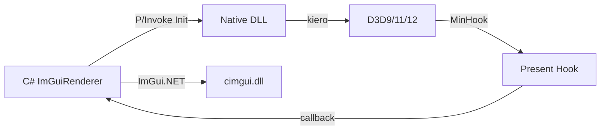

# StArray.ModManager

Android IL2CPP Unity mod manager with CoreCLR runtime embedding and ImGui overlay UI.

## How It Works

1. **Native injection** via `libmodmanager.so` loaded into Unity process
2. **Dobby hook** on `eglSwapBuffers` and Android input events
3. **CoreCLR embedded** at runtime, launching .NET managed code from JNI
4. **UnityResolve** reflection engine traverses IL2CPP/Mono managed types
5. **ImGui overlay** rendered via EGL + OpenGL ES with touch and keyboard IME

## Project Structure

```
StArray.ModManager/              C# mod manager (.NET 10)
  Managed.cs                     CoreCLR entry – Logger桥接 → 扫描Mod → 启动ImGui
  Il2Cpp/                        IL2CPP 内部类型 C# 翻译
    Core.cs / Types.cs           Vector2/3/4, Quaternion, Il2CppString, Il2CppArray<T> 等
    Reflection.cs                Il2CppAssembly, Il2CppClass, Il2CppMethod, Il2CppField
    Unity.cs                     UnityObject, Component, Transform, GameObject, Camera
    Coroutine.cs
  Inspector/                     ImGui 自动检查器 + 设置特性（[ModSettingRange] 等）
  Manager/                       核心逻辑
    ModLoader.cs                 Mod 扫描/加载/卸载/状态管理
    ModManagerUI.cs              ImGui 主面板 + 设置窗口 + Overlay 背景/前景渲染
    ModManagerConfig.cs          全局配置 JSON 持久化（STJ 源生成）
    Logger.cs                    统一日志 → logcat + 文件双写
    Benchmark.cs                 栈式嵌套计时
  Native/                        原生绑定（Dobby, DL, JNI, AndroidUtils, UnityResolve）
  Runtime/                       Mod 接口
    IModPlugin.cs                OnLoad/OnUnload/OnBackgroundGUI/OnForegroundGUI
    IModSettings.cs / IModSettingCustomDraw.cs
  UI/                            ImGui EGL/Vulkan 渲染器 + 输入处理 + FA7 图标

Android/library/                 原生库 (libmodmanager.so)
  src/main/cpp/core/             Dobby hook / CoreCLR 嵌入 / JNI helper / UnityResolve
  src/main/java/
    ModManager.java              CoreCLR 启动器
    ModManagerUpdater.java       OTA 自动更新（CompletableFuture + AlertDialog）
    ModManagerUtils.java         IME KeyboardView + InputConnection
```

## Features

- **EGL SwapBuffers hook** with Dobby — renders ImGui overlay every frame
- **Touch & key input** via InputConsumer hooks + cimgui Android backend
- **IME support** (Chinese/Japanese) via custom KeyboardView + InputConnection bridge
- **Mod system** — scan/load/unload with dependency resolution + auto-enable on restart
- **Mod overlay API** — `OnBackgroundGUI` / `OnForegroundGUI` for direct game-screen drawing
- **Auto-update** — OTA version check + download + SHA-256 verification + restart
- **Config persistence** — STJ source-gen JSON, AOT-compatible
- **File logging** — dual-write to logcat + `manager.log`
- **GL debug panel** — caps toggles, blend/depth func selectors, GL state queries
- **FontAwesome 7** icon support via embedded resource
- **IImGuiRenderer** interface — swap between EGL, Vulkan backends
- **CoreCLR args** — pass `string[]` from Java to managed `Entry(int, IntPtr)`

## Third-Party Libraries

| Library | License | Used In |
|---------|---------|---------|
| [Dear ImGui](https://github.com/ocornut/imgui) | MIT | UI rendering |
| [cimgui](https://github.com/cimgui/cimgui) | MIT | ImGui C API bindings |
| [ImGui.NET](https://github.com/ImGuiNET/ImGui.NET) | MIT | C# ImGui bindings |
| [kiero2](https://github.com/kirchesz/kiero2) | MIT | Graphics API detection (D3D9/11/12/GL/VK) |
| [MinHook](https://github.com/TsudaKageyu/minhook) | BSD-2 | API hooking |
| [Corehold](https://github.com/StArraySharp/Corehold) | MIT | winmm proxy DLL + CoreCLR hosting |
| [Dobby](https://github.com/jmpews/Dobby) | Apache-2.0 | Android inline hook |
| [CoreCLR](https://github.com/dotnet/runtime) | MIT | .NET runtime |
| [FontAwesome 7](https://fontawesome.com) | OFL/SIL | Icon font |

## Build

Requires .NET 10 SDK + MinGW (gcc/cmake on PATH).

```bash
# Windows (native + C#, one command)
dotnet build StArray.ModManager.Windows -c Release

# Android
cd Android && ./gradlew :library:assembleRelease
```

## Windows Architecture

The Windows native DLL (`StArray.ModManager.Windows.Native.dll`) uses
[kiero2](https://github.com/kirchesz/kiero2) + [MinHook](https://github.com/TsudaKageyu/minhook) to
detect and hook the game's graphics API at runtime.

| Backend | Support |
|---------|---------|
| D3D12 | Descriptor heap + Command list |
| D3D11 | Device + Context |
| D3D9  | Device |
| OpenGL / Vulkan | Detected only |

The C# side (`ImGuiRenderer`) is backend-agnostic — it provides init/shutdown/render callbacks and
the native DLL handles all platform-specific `ImGui_Impl*` setup.



## Target

- Windows x64 (D3D9/11/12) — DLL injection or CoreCLR hosting
- Android arm64-v8a (OpenGL ES) — IL2CPP Unity games (API 26+)
- CoreCLR .NET 10 runtime

## Getting Started

```bash
git clone --recurse-submodules https://github.com/StArraySharp/StArray.ModManager.git
dotnet build StArray.ModManager.Windows -c Release
```

See [GET_STARTED.md](GET_STARTED.md) for injection and build instructions.

Runtime assemblies can be downloaded from the [runtime-references release](https://github.com/StArraySharp/StArray.ModManager/releases/tag/0).

---

Most code generated by AI.
