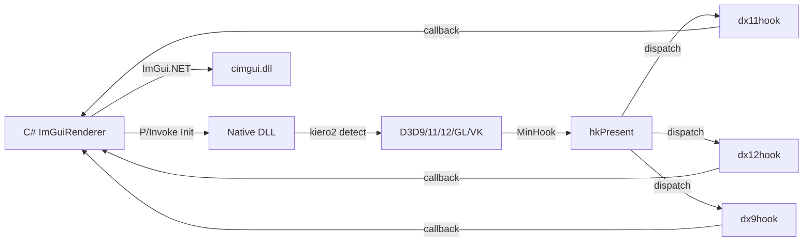

# StArray.ModManager

[English](README.md) | 简体中文

Android IL2CPP Unity Mod 管理器，内嵌 CoreCLR 运行时并使用 ImGui 覆盖层 UI。

## 工作原理

1. **原生注入** — `libmodmanager.so` 加载进 Unity 进程
2. **Dobby hook** — 钩住 `eglSwapBuffers` 与 Android 输入事件
3. **运行时内嵌 CoreCLR** — 从 JNI 启动 .NET 托管代码
4. **UnityResolve** 反射引擎遍历 IL2CPP/Mono 托管类型
5. **ImGui 覆盖层** — 通过 EGL + OpenGL ES 渲染，支持触摸与键盘 IME

## 功能特性

- 基于 Dobby 的 **eglSwapBuffers hook** — 每帧渲染 ImGui 覆盖层
- **触摸与按键输入** — InputConsumer hook + cimgui Android 后端
- **IME 输入法支持**（中文/日文）— 自定义 KeyboardView + InputConnection 桥接
- **Mod 系统** — 扫描/加载/卸载 + 依赖解析 + 重启自动启用
- **Mod 覆盖层 API** — `OnBackgroundGUI` / `OnForegroundGUI` 直接绘制到游戏画面
- **自动更新** — OTA 版本检查 + 下载 + SHA-256 校验 + 重启
- **配置持久化** — STJ source-gen JSON，AOT 兼容
- **文件日志** — 双写 logcat + `manager.log`
- **GL 调试面板** — caps 开关、混合/深度函数选择器、GL 状态查询
- **FontAwesome 7** 图标 — 内嵌资源
- **IImGuiRenderer** 接口 — 可在 EGL、Vulkan 后端间切换
- **CoreCLR 参数** — 从 Java 传 `string[]` 给托管 `Entry(int, IntPtr)`
- **CoreCLR 打包进 AAR** — `copyCoreClrToJniLibs` 把运行时 .so 拷入 jniLibs

## API 参考

### Mod 入口

| 接口 | 方法 | 说明 |
|------|------|------|
| `IModPlugin` | `OnLoad()` | Mod 加载时调用 |
| | `OnUnload()` | Mod 卸载时调用 |
| | `OnBackgroundGUI(ImDrawListPtr)` | 在 ImGui 窗口后方绘制 |
| | `OnForegroundGUI(ImDrawListPtr)` | 在 ImGui 窗口上方绘制 |
| `IModSettings` | `OnGui()` | 在 ModManager 中绘制自定义设置页 |

### Hook

`[NativeHook]` 支持三种模式：

| 特性 | 说明 |
|------|------|
| `[NativeHook("lib.so", "symbolName")]` | 符号导出 hook — 用 `dlsym` 解析 |
| `[NativeHook("lib.so", 0x1234)]` | RVA hook — 用 `GetFuncPtr(base + 0x1234)` |
| `[NativeHook(nameof(ResolverMethod))]` | 解析器模式 — 引用同类中的 `static nint ResolverMethod()`；支持 `"Namespace.Type.Method"` 跨类引用 |

生成的 partial class 提供 `InstallHooks()` / `UninstallHooks()`，以及用于调用原函数的 `*Original` 委托。

### Stub（类型化游戏对象包装）

| 基类 | 说明 |
|------|------|
| `UnmanagedObject` | 包装 `nint` 指针，提供 `Obj` 字段用于运行时访问 |
| `Wrap<T>(nint ptr)` | 返回包装指定指针的类型化 stub |

### 运行时反射

| 类 | 关键方法 | 说明 |
|----|---------|------|
| `RuntimeObject` | `GetField<T>(string)` / `SetField(string, T)` | 读/写实例字段 |
| | `Invoke<T>(string, params object[])` | 调用实例方法 |
| | `GetProperty<T>(string)` / `SetProperty(string, T)` | 读/写属性 |
| `RuntimeArray<T>` | `new RuntimeArray<T>(nint ptr)` | 强类型数组包装 |
| | `.Length` / `[index]` | 数组长度与元素访问 |
| `RuntimeManager` | `GetDomain()` / `IsIl2Cpp` | 检测当前运行时并获取 domain |
| `IAppDomain` | `OpenAssembly(string)` | 打开已加载的程序集 |
| `IRuntimeAssembly` | `GetClass(string ns, string name)` | 按命名空间 + 类名获取类 |
| `IRuntimeClass` | `GetMethod(string, int)` / `GetField(string)` | 获取可调用的方法/字段 |
| `IRuntimeMethod` | `Invoke(nint thisPtr, params object[])` / `InvokeStatic()` | 调用方法 |
| `IRuntimeField` | `GetValue<T>(nint)` / `SetValue(nint, T)` | 读/写字段 |

### NativeFuncResolver

| 方法 | 说明 |
|------|------|
| `FindRva(string symbol, byte?[]? pattern)` | 符号 → RVA，失败回退特征码扫描 |
| `FindSymbolRva(string)` | 在 `.dynsym` + `.dynstr` 中精确匹配符号名 |
| `FindRva(byte?[] pattern)` | 对 `.text` 段做特征码扫描 |
| `ParseHexPattern(string)` | 把 `"48 89 ?? ?? ?? ?? ?? ff"` 转成匹配模式 |
| `Resolve(string, byte?[]?)` | 加载库 + 查找 + 返回函数指针 |

### 设置特性

| 特性 | 参数 | 说明 |
|------|------|------|
| `[ModSettingLabel("text")]` | `string` | 设置字段的显示标签 |
| `[ModSettingLabelSide(ModInspector.LabelSide)]` | `Left` / `Right` | 标签位置 |
| `[ModSettingRange(min, max)]` | `float, float` | 数值夹取范围 |
| `[ModSettingJson(Lines = N)]` | `int` | 多行 JSON 编辑器 |

### Inspector

| 方法 | 说明 |
|--------|------|
| `ModInspector.Draw(object)` | 为所有带 `[ModSettingLabel]` 的字段自动生成 UI |

### 工具类

| 类 | 说明 |
|----|------|
| `Logger` | `Info(string)`、`Warn(string)`、`Error(string)` — 统一日志 |
| `HookHelper` | `Instance` — 设为你的 hook 实现；`GetFunctionRVA` / `GetFunctionRVAFallback` |
| `BehaviourManager` | 在 Unity 生命周期事件上调度操作 |
| `DL` | 跨平台 `Open` / `Symbol` / `Close` / `Error` / `Addr` / `GetBaseAddress` |

## 第三方库

| 库 | 许可证 | 用于 |
|----|--------|------|
| [Dear ImGui](https://github.com/ocornut/imgui) | MIT | UI 渲染 |
| [cimgui](https://github.com/cimgui/cimgui) | MIT | ImGui C API 绑定 |
| [ImGui.NET](https://github.com/ImGuiNET/ImGui.NET) | MIT | C# ImGui 绑定 |
| [kiero2](https://github.com/kirchesz/kiero2) | MIT | 图形 API 检测 (D3D9/11/12/GL/VK) |
| [MinHook](https://github.com/TsudaKageyu/minhook) | BSD-2 | API hook |
| [Corehold](https://github.com/StArraySharp/Corehold) | MIT | winmm 代理 DLL + CoreCLR 宿主 |
| [Dobby](https://github.com/jmpews/Dobby) | Apache-2.0 | Android inline hook |
| [CoreCLR](https://github.com/dotnet/runtime) | MIT | .NET 运行时 |
| [FontAwesome 7](https://fontawesome.com) | OFL/SIL | 图标字体 |

## 构建

| 平台 | 前置条件 |
|------|----------|
| Windows | .NET 10 SDK；Visual Studio 并安装 **使用 C++ 的桌面开发**（MSVC + Windows SDK）与 **适用于 Windows 的 C++ CMake 工具**（CMake + Ninja 需在 PATH） |
| Android | Android NDK（cmake 需在 PATH） |

```bash
# Windows（原生 + C#，一条命令）
dotnet build StArray.ModManager.Windows -c Release

# Android
cd Android && ./gradlew :library:assembleRelease
```

### Windows：克隆后还原 cimgui 符号链接

`StArray.ModManager.CImGui/` 是两个平台共享的 cimgui 源码。Windows 与 Android
原生构建通过两个 git 符号链接（`StArray.ModManager.Windows/Native/cimgui`、
`Android/library/src/main/cpp/libs/cimgui`）接入；在 Windows 上只有开启
**开发者模式**（或使用管理员 shell）时它们才会被还原成真正的链接——否则会被检出为
纯文本文件，CMake 构建因缺少 `cimgui` 引用而失败。克隆后一次性修复：

```bash
# 1. 先开启 Windows 开发者模式，然后：
git config core.symlinks true
rm StArray.ModManager.Windows/Native/cimgui Android/library/src/main/cpp/libs/cimgui
git checkout -- StArray.ModManager.Windows/Native/cimgui Android/library/src/main/cpp/libs/cimgui
```

## Windows 架构

原生 DLL（`StArray.ModManager.Windows.Native.dll`）使用
[kiero2](https://github.com/kirchesz/kiero2) 检测图形 API，用
[MinHook](https://github.com/TsudaKageyu/minhook) 钩住 `Present`。

**按后端拆分的 hook 文件**（`Native/`）：

| 文件 | 后端 | 初始化 | 渲染 |
|------|------|--------|------|
| `dx12hook.cpp` | D3D12 | 描述符堆、命令列表、逐帧 RTV 上下文 | 资源屏障 + OMSetRenderTargets |
| `dx11hook.cpp` | D3D11 | Device + Context + 持久化后台缓冲 RTV | OMSetRenderTargets + RenderDrawData |
| `dx9hook.cpp`  | D3D9  | SwapChain QI → Device | 视口/裁剪矩形保存-恢复 |
| `main.cpp`     | GL/VK | 仅 Win32 初始化（C# 处理后端） | 仅 C# 渲染回调 |

**统一分发**（`main.cpp` 的 `hkPresent`）：
- 所有后端共享 `DisplaySize`、`ImGui_ImplWin32_NewFrame`、WndProc hook
- `DEBUG_LOG` 条件编译（`NDEBUG` → Release 下编译剔除）
- 窗口句柄取自 `SwapChain::GetDesc().OutputWindow`



## 目标平台

- Windows x64（D3D9/11/12）— DLL 注入或 CoreCLR 宿主
- Android arm64-v8a（OpenGL ES）— IL2CPP Unity 游戏（API 26+）
- CoreCLR .NET 10 运行时

## 快速开始

```bash
git clone --recurse-submodules https://github.com/StArraySharp/StArray.ModManager.git
```

Windows 上请先完成 [构建](#构建) 章节中的一次性 cimgui 符号链接设置，再运行：

```bash
dotnet build StArray.ModManager.Windows -c Release
```

注入与构建说明见 [GET_STARTED.md](GET_STARTED.md)。

运行时程序集可从 [runtime-references release](https://github.com/StArraySharp/StArray.ModManager/releases/tag/0) 下载。

---

大部分代码由 AI 生成。
